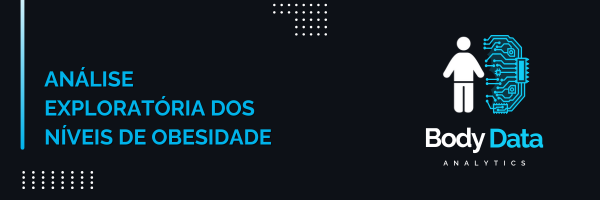

# Análise Exploratória dos Níveis de Obesidade

    

Este projeto tem como objetivo analisar os níveis de obesidade com base em fatores como hábitos alimentares, níveis de atividade física e outras características demográficas e comportamentais. Além da análise exploratória dos dados, será realizada uma modelagem preditiva para classificar os níveis de obesidade dos indivíduos a partir desses atributos. O objetivo é entender como diferentes variáveis, como alimentação, atividade física e fatores pessoais, impactam os níveis de obesidade e criar um modelo que possa prever o risco de obesidade em novas amostras com base nesses dados. Através dessa análise, busco gerar insights que podem ajudar em ações preventivas e estratégias de saúde pública.

## Justificativa

A análise e previsão dos níveis de obesidade é um desafio relevante para a saúde pública, dado o impacto significativo da obesidade em diversas doenças crônicas, como diabetes tipo 2, hipertensão e problemas cardiovasculares. Compreender os fatores que contribuem para o desenvolvimento da obesidade e a previsão de seus níveis pode fornecer informações importantes para a prevenção e o tratamento eficaz dessas enfermidades. Além disso, um modelo preditivo bem construído pode auxiliar na identificação precoce de indivíduos em risco, permitindo a implementação de intervenções preventivas mais eficazes.

Neste projeto, a minha abordagem se concentrará em analisar como diferentes fatores, como hábitos alimentares e níveis de atividade física, influenciam os níveis de obesidade, utilizando técnicas de análise exploratória de dados e modelagem preditiva, incluindo:

1. Quais variáveis têm maior impacto no nível de obesidade de uma pessoa? 
2. Como podemos prever os níveis de obesidade com base nas características comportamentais e de saúde conhecidas? 
3. Existem padrões ou grupos de risco específicos que podem ser utilizados para prever a tendência de obesidade em diferentes populações?

## Metodologia

O projeto será desenvolvido utilizando a metodologia CRISP-DM, seguindo os seguintes passos:

1. Entendimento de negócio
2. Entendimento de dados
3. Preparação dos dados
4. Modelagem

O projeto também é dividido em duas entregas, a saber:

1. **Análise Exploratória de Dados (EDA)**: entendimento das variáveis que influenciam o MPG e identificação de padrões nos dados através de hipóteses, visualizações e insights.
2. **Análise comparativa de modelos**: construção de modelos de aprendizado de máquina para rpevisão de consumo, com métricas de desempenho para avaliação da performance.

## Resultados Esperados

Espero identificar as principais variáveis que influenciam os níveis de obesidade e desenvolver um modelo preditivo capaz de estimar os níveis de obesidade com base em hábitos alimentares e atividades físicas. Com isso, buscamos fornecer insights valiosos para profissionais de saúde e políticas públicas, permitindo a identificação precoce de indivíduos em risco e a criação de intervenções mais eficazes. Além disso, esperamos contribuir para uma melhor compreensão dos fatores que contribuem para a obesidade e como eles podem ser monitorados e gerenciados de maneira mais eficiente.

## Desenvolvedores
 - [João Paulo Ferreira](https://github.com/joao-paulo-alt)